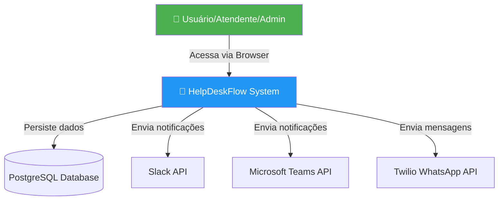
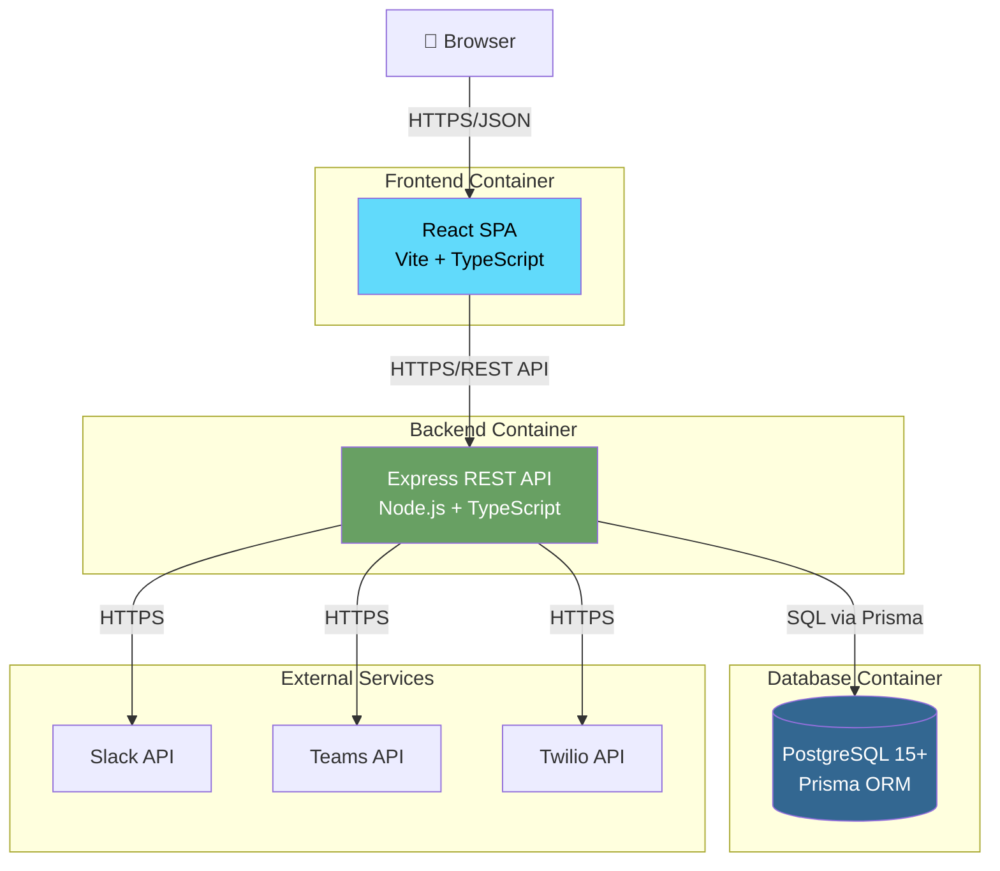
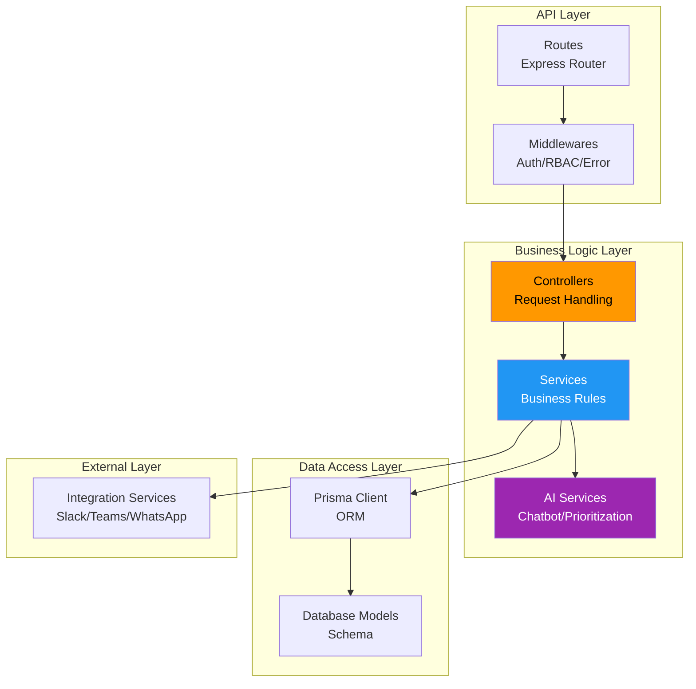
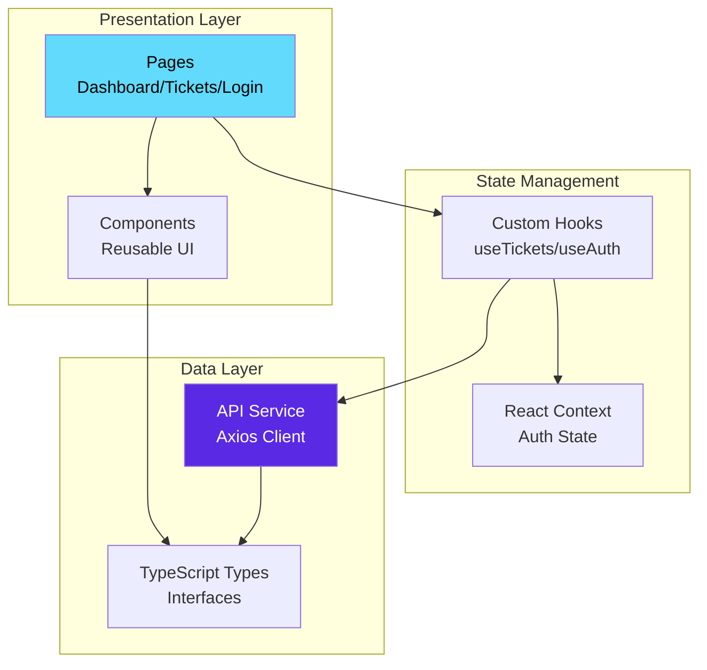
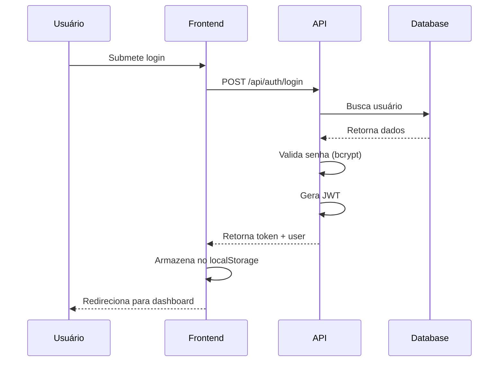
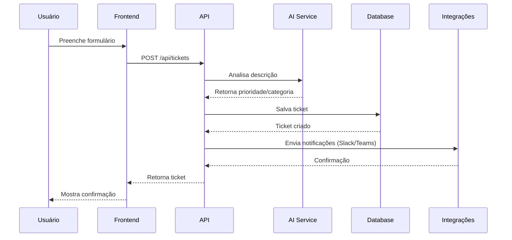
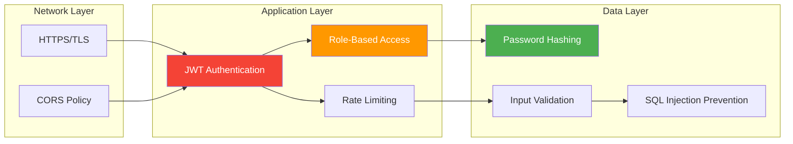
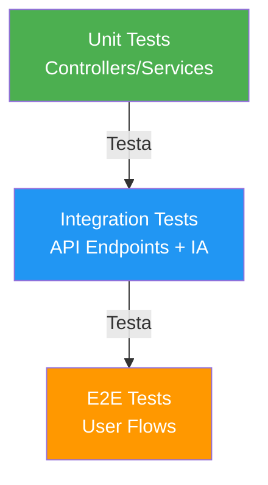

# 🏗️ Arquitetura do HelpDeskFlow

## Visão Geral

O HelpDeskFlow é uma aplicação full-stack construída com arquitetura em camadas, seguindo princípios de Clean Architecture e Domain-Driven Design.

---

## 📐 Diagramas de Arquitetura (C4 Model)

### Nível 1: Diagrama de Contexto



### Nível 2: Diagrama de Containers



### Nível 3: Diagrama de Componentes (Backend)



### Nível 3: Diagrama de Componentes (Frontend)



---

## 🔄 Fluxo de Dados

### Fluxo de Autenticação



### Fluxo de Criação de Ticket com IA



---

## 🗂️ Estrutura de Diretórios

### Backend

```
backend/
├── prisma/
│   ├── schema.prisma           # Schema do banco de dados
│   ├── migrations/             # Histórico de migrations
│   └── seed.ts                 # Dados iniciais
├── src/
│   ├── config/                 # Configurações (env, constants)
│   ├── controllers/            # Controllers (request handling)
│   │   ├── auth.controller.ts
│   │   ├── ticket.controller.ts
│   │   ├── dashboard.controller.ts
│   │   └── feedback.controller.ts
│   ├── middlewares/            # Middlewares
│   │   ├── auth.middleware.ts  # JWT validation
│   │   ├── role.middleware.ts  # RBAC
│   │   └── error.middleware.ts # Error handling
│   ├── services/               # Business logic
│   │   ├── ai/
│   │   │   ├── chatbot.service.ts
│   │   │   ├── prioritization.service.ts
│   │   │   └── sentiment.service.ts
│   │   ├── integrations/
│   │   │   ├── slack.service.ts
│   │   │   ├── teams.service.ts
│   │   │   └── whatsapp.service.ts
│   │   └── ticket.service.ts
│   ├── routes/                 # Route definitions
│   │   ├── auth.routes.ts
│   │   ├── ticket.routes.ts
│   │   └── index.ts
│   ├── types/                  # TypeScript types
│   │   └── express.d.ts
│   ├── utils/                  # Utilities
│   │   ├── validators.ts
│   │   └── helpers.ts
│   └── server.ts               # Entry point
└── package.json
```

### Frontend

```
frontend/
├── public/                     # Assets estáticos
├── src/
│   ├── components/             # Componentes reutilizáveis
│   │   ├── common/
│   │   │   ├── Button.tsx
│   │   │   ├── Input.tsx
│   │   │   └── Modal.tsx
│   │   ├── tickets/
│   │   │   ├── TicketCard.tsx
│   │   │   ├── TicketForm.tsx
│   │   │   └── TicketList.tsx
│   │   └── layout/
│   │       ├── Header.tsx
│   │       ├── Sidebar.tsx
│   │       └── Footer.tsx
│   ├── pages/                  # Páginas
│   │   ├── Login.tsx
│   │   ├── Dashboard.tsx
│   │   ├── Tickets.tsx
│   │   └── TicketDetails.tsx
│   ├── services/               # API client
│   │   ├── api.ts              # Axios configuration
│   │   ├── auth.service.ts
│   │   └── ticket.service.ts
│   ├── types/                  # TypeScript types
│   │   ├── ticket.types.ts
│   │   └── user.types.ts
│   ├── utils/                  # Utilities
│   │   └── helpers.ts
│   ├── App.tsx                 # Root component
│   └── main.tsx                # Entry point
└── package.json
```

---

## 🎯 Decisões Técnicas

### 1. TypeScript em Todo o Projeto

**Decisão**: Usar TypeScript tanto no frontend quanto no backend.

**Motivos**:
- ✅ Type-safety reduz bugs em produção
- ✅ Melhor DX com autocomplete e IntelliSense
- ✅ Refatoração mais segura
- ✅ Documentação implícita via tipos

**Trade-offs**:
- ❌ Curva de aprendizado inicial
- ❌ Tempo de build ligeiramente maior

### 2. Prisma ORM

**Decisão**: Usar Prisma em vez de TypeORM ou Sequelize.

**Motivos**:
- ✅ Type-safety completo
- ✅ Migrations declarativas
- ✅ Prisma Studio para debugging
- ✅ Excelente DX

**Trade-offs**:
- ❌ Queries complexas podem ser verbosas
- ❌ Menos flexibilidade que SQL puro

### 3. JWT para Autenticação

**Decisão**: Usar JWT stateless em vez de sessions.

**Motivos**:
- ✅ Escalável horizontalmente
- ✅ Não requer armazenamento de sessão
- ✅ Funciona bem com APIs REST
- ✅ Suporte a refresh tokens

**Trade-offs**:
- ❌ Não é possível invalidar tokens imediatamente
- ❌ Tokens podem crescer com muitos claims

### 4. Vite para Frontend

**Decisão**: Usar Vite em vez de Create React App.

**Motivos**:
- ✅ Build extremamente rápido
- ✅ HMR instantâneo
- ✅ Configuração moderna
- ✅ Melhor suporte a ESM

**Trade-offs**:
- ❌ Ecossistema menor que Webpack
- ❌ Alguns plugins antigos incompatíveis

### 5. Monorepo vs Multi-repo

**Decisão**: Estrutura monorepo simples (backend + frontend na mesma raiz).

**Motivos**:
- ✅ Facilita compartilhamento de tipos
- ✅ Deploy mais simples
- ✅ Ideal para projetos pequenos/médios

**Trade-offs**:
- ❌ Não usa ferramentas avançadas (Nx, Turborepo)
- ❌ CI/CD menos granular

### 6. IA Implementada Internamente

**Decisão**: Implementar lógica de IA com algoritmos próprios em vez de APIs externas.

**Motivos**:
- ✅ Sem custo adicional de APIs
- ✅ Controle total sobre a lógica
- ✅ Sem dependência de serviços externos
- ✅ Resposta instantânea

**Trade-offs**:
- ❌ Menos sofisticado que GPT/Claude
- ❌ Requer manutenção manual de regras

---

## 🔐 Segurança

### Camadas de Segurança



### Medidas Implementadas

1. **Autenticação**
   - JWT com expiração de 24h
   - Refresh tokens com expiração de 7 dias
   - Senhas hasheadas com bcrypt (12 rounds)

2. **Autorização**
   - RBAC com 3 níveis (Admin, Atendente, Usuário)
   - Middleware de validação em todas as rotas protegidas
   - Princípio de menor privilégio

3. **Proteção de API**
   - Rate limiting (100 requisições/15min)
   - Helmet.js para headers de segurança
   - CORS configurado para domínios específicos

4. **Validação**
   - Zod para validação de schemas
   - Sanitização de inputs
   - Prisma protege contra SQL injection

---

## 📊 Performance

### Otimizações Implementadas

1. **Frontend**
   - Code splitting por rota
   - Lazy loading de componentes
   - Memoização com React.memo
   - Debounce em buscas

2. **Backend**
   - Índices no banco de dados
   - Queries otimizadas com Prisma
   - Caching de dados frequentes
   - Paginação em listas grandes

3. **Database**
   - Índices em colunas de busca
   - Foreign keys com índices
   - EXPLAIN para queries complexas

---

## 🔄 Escalabilidade

### Estratégias

1. **Horizontal Scaling**
   - Stateless API (JWT)
   - Load balancer ready
   - Database connection pooling

2. **Vertical Scaling**
   - Otimização de queries
   - Caching strategies
   - Resource monitoring

3. **Database**
   - Read replicas (futuro)
   - Particionamento de tabelas (futuro)
   - Archiving de dados antigos

---

## 📝 Padrões de Código

### Convenções

1. **Nomenclatura**
   - Arquivos: `kebab-case.ts`
   - Classes: `PascalCase`
   - Funções/variáveis: `camelCase`
   - Constantes: `UPPER_SNAKE_CASE`

2. **Estrutura de Funções**
   ```typescript
   // Controllers: Lidam com request/response
   export const createTicket = async (req: Request, res: Response) => {
     // 1. Validação
     // 2. Chamada ao service
     // 3. Resposta
   }
   
   // Services: Lógica de negócio
   export const ticketService = {
     create: async (data: CreateTicketDTO) => {
       // Business logic here
     }
   }
   ```

3. **Error Handling**
   - Middleware centralizado de erros
   - Erros customizados com status codes
   - Logging estruturado de erros

---

## 🧪 Testabilidade

### Estratégia de Testes



**Cobertura esperada**: 80%+ para código crítico

---

## 📚 Documentação Adicional

- [README.md](./README.md) - Guia de início rápido
- [CONTRIBUTING.md](./CONTRIBUTING.md) - Guia de contribuição (a criar)
- [API.md](./API.md) - Documentação completa da API (a criar)

---

## 🔮 Roadmap Técnico

### Curto Prazo (1-2 meses)
- [ ] Implementar testes automatizados
- [ ] CI/CD com GitHub Actions
- [ ] Logging estruturado
- [ ] Métricas de performance

### Médio Prazo (3-6 meses)
- [ ] Migrar IA para LLM (OpenAI/Anthropic)
- [ ] Implementar WebSockets para real-time
- [ ] Cache com Redis
- [ ] Filas com Bull/BullMQ

### Longo Prazo (6+ meses)
- [ ] Microserviços (se necessário)
- [ ] Kubernetes deployment
- [ ] Multi-tenancy
- [ ] App mobile (React Native)

---

**Última atualização**: Novembro 2025  
**Mantenedor**: Márcio Gil
