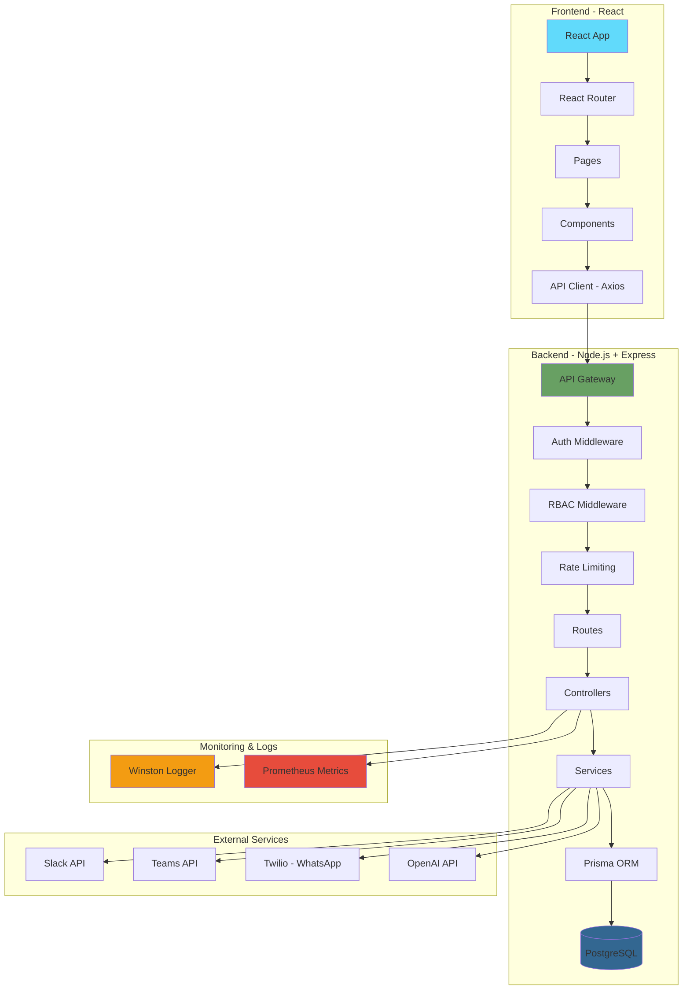
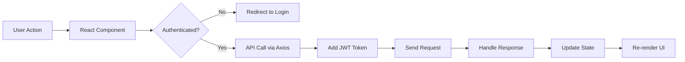
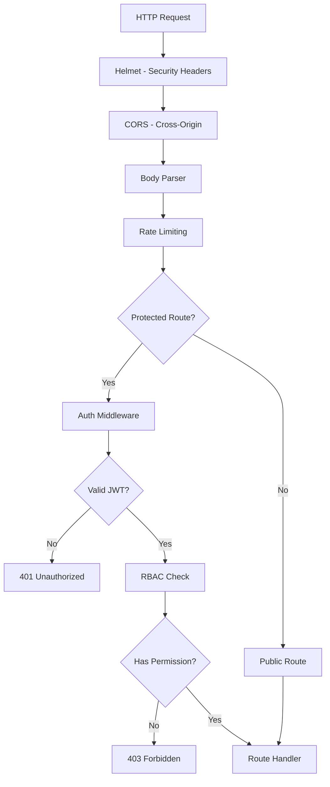
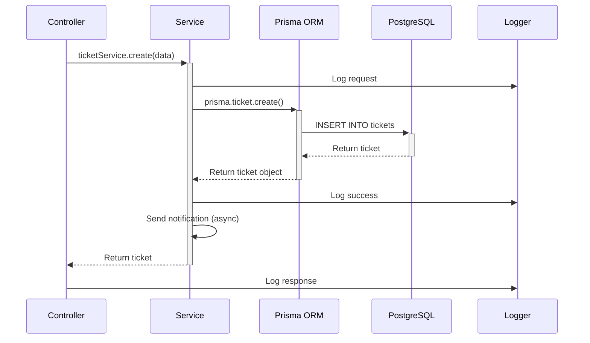
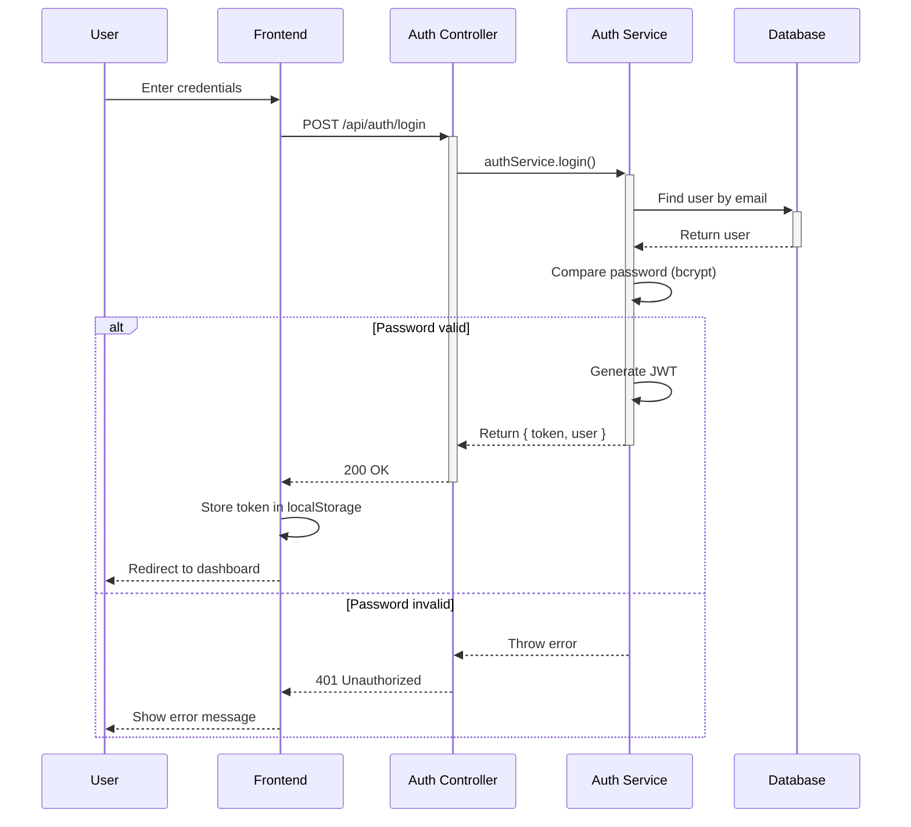
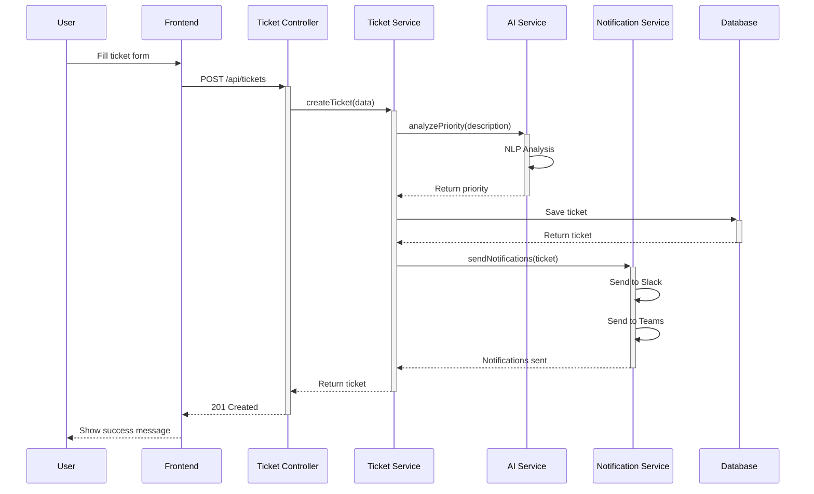
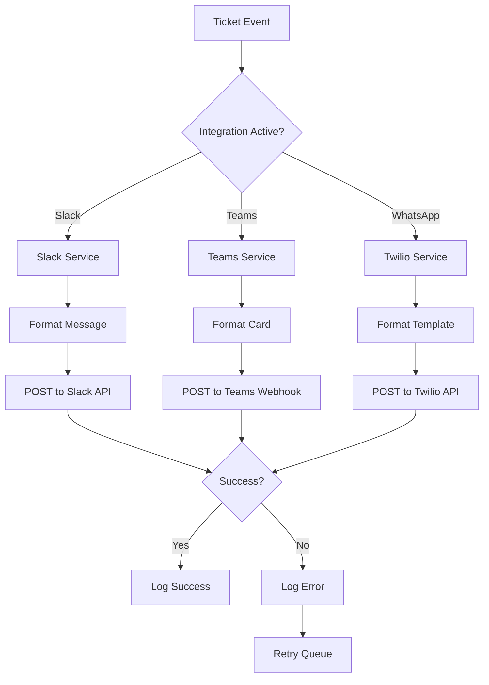
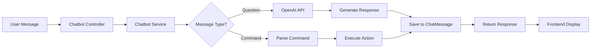
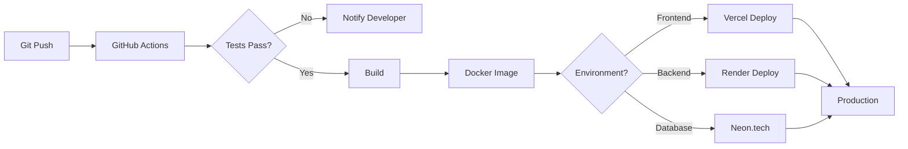
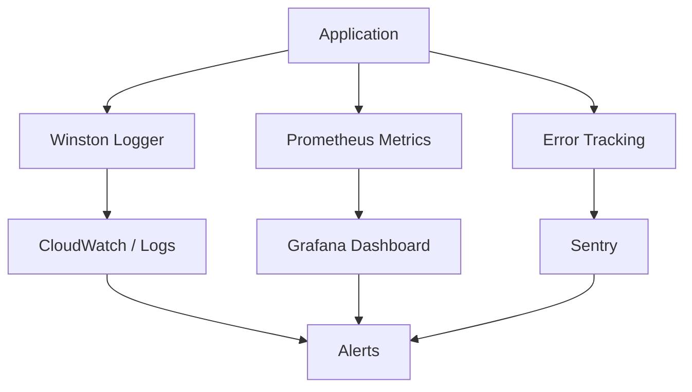

# 🏗️ Arquitetura do Sistema

## Diagrama de Fluxo Geral



---

## Fluxo Detalhado por Camada

### 1️⃣ **Frontend (React + Vite)**



**Responsabilidades:**
- 🎨 Renderização da interface
- 🔐 Gerenciamento de autenticação (JWT)
- 📊 Estado global (Context API)
- 🔄 Comunicação com backend via Axios

---

### 2️⃣ **API Gateway & Middlewares**



**Middlewares em ordem:**
1. **Helmet**: Adiciona headers de segurança
2. **CORS**: Controla origens permitidas
3. **Body Parser**: Parse JSON/form-data
4. **Rate Limiting**: Limita requisições por IP
5. **Auth Middleware**: Valida JWT
6. **RBAC Middleware**: Verifica permissões

---

### 3️⃣ **Controllers → Services → Database**



**Separação de Responsabilidades:**

| Camada | Responsabilidade | Exemplo |
|--------|------------------|---------|
| **Controller** | Receber request, validar entrada, retornar response | `TicketController.create()` |
| **Service** | Lógica de negócio, orquestração | `TicketService.create()` |
| **Prisma** | Queries ao banco, transactions | `prisma.ticket.create()` |
| **Database** | Armazenamento persistente | PostgreSQL |

---

### 4️⃣ **Fluxo de Autenticação**



---

### 5️⃣ **Fluxo de Criação de Ticket com IA**



---

### 6️⃣ **Fluxo de Integração com Serviços Externos**



**Integrações Implementadas:**
- **Slack**: Blocks API para mensagens ricas
- **Microsoft Teams**: Adaptive Cards
- **WhatsApp**: Twilio Business API

---

### 7️⃣ **Fluxo de Chatbot com IA**



---

## 📁 Estrutura de Pastas Detalhada

```
backend/
├── src/
│   ├── controllers/           # Camada de controle (HTTP handlers)
│   │   ├── auth.controller.ts
│   │   ├── ticket.controller.ts
│   │   ├── chatbot.controller.ts
│   │   └── integration.controller.ts
│   │
│   ├── services/              # Lógica de negócio
│   │   ├── auth.service.ts
│   │   ├── ticket.service.ts
│   │   ├── ai.service.ts
│   │   ├── notification.service.ts
│   │   └── integration.service.ts
│   │
│   ├── middlewares/           # Middlewares Express
│   │   ├── auth.middleware.ts
│   │   ├── role.middleware.ts
│   │   ├── error.middleware.ts
│   │   └── metrics.middleware.ts
│   │
│   ├── routes/                # Definição de rotas
│   │   ├── auth.routes.ts
│   │   ├── ticket.routes.ts
│   │   ├── chatbot.routes.ts
│   │   └── index.ts
│   │
│   ├── types/                 # Tipos TypeScript
│   │   ├── express.d.ts
│   │   └── models.ts
│   │
│   ├── utils/                 # Utilitários
│   │   ├── logger.ts
│   │   ├── validation.ts
│   │   └── crypto.ts
│   │
│   └── server.ts              # Entry point
│
├── prisma/
│   ├── schema.prisma          # Schema do banco
│   ├── migrations/            # Histórico de migrations
│   └── seed.ts                # Dados iniciais
│
└── tests/                     # Testes
    ├── unit/
    ├── integration/
    └── e2e/

frontend/
├── src/
│   ├── components/            # Componentes reutilizáveis
│   │   ├── common/
│   │   ├── layout/
│   │   └── tickets/
│   │
│   ├── pages/                 # Páginas/Rotas
│   │   ├── Login.tsx
│   │   ├── Dashboard.tsx
│   │   ├── Tickets.tsx
│   │   └── TicketDetails.tsx
│   │
│   ├── services/              # API Client
│   │   ├── api.ts
│   │   ├── auth.service.ts
│   │   └── ticket.service.ts
│   │
│   ├── hooks/                 # Custom React Hooks
│   │   ├── useAuth.ts
│   │   └── useTickets.ts
│   │
│   ├── context/               # Context API
│   │   └── AuthContext.tsx
│   │
│   ├── types/                 # Tipos TypeScript
│   │   └── models.ts
│   │
│   └── App.tsx                # Entry point
│
└── tests/                     # Testes
    ├── unit/
    └── e2e/
```

---

## 🔧 Padrões de Projeto Utilizados

### **MVC (Model-View-Controller)**
- **Model**: Prisma schema + Database
- **View**: React Components
- **Controller**: Express Controllers

### **Repository Pattern**
```typescript
// Service usa Prisma como repository
class TicketService {
  async findAll() {
    return prisma.ticket.findMany();
  }
}
```

### **Dependency Injection**
```typescript
// Controllers recebem services como dependência
class TicketController {
  constructor(private ticketService: TicketService) {}
}
```

### **Factory Pattern**
```typescript
// Criação de notificações
class NotificationFactory {
  create(type: 'slack' | 'teams' | 'whatsapp') {
    // ...
  }
}
```

---

## 🚀 Fluxo de Deploy



---

## 📊 Monitoramento e Observabilidade



---

## 🔐 Segurança em Camadas

| Camada | Mecanismo | Implementação |
|--------|-----------|---------------|
| **Transport** | HTTPS/TLS | Certificado SSL/TLS |
| **Authentication** | JWT | Token com 24h de validade |
| **Authorization** | RBAC | 3 roles: USER, ATTENDANT, ADMIN |
| **Input Validation** | Zod | Schema validation |
| **Password** | bcrypt | 12 rounds de hash |
| **Rate Limiting** | express-rate-limit | 100 req/15min por IP |
| **Headers** | Helmet | XSS, CSP, HSTS |
| **Database** | Prisma | Prepared statements |

---

## 🎯 Performance

### Otimizações Implementadas:
- ✅ **Code Splitting** no frontend (Vite)
- ✅ **Lazy Loading** de componentes React
- ✅ **Índices de banco** otimizados
- ✅ **Connection pooling** (Prisma)
- ✅ **Compressão** de respostas HTTP

### Otimizações Recomendadas:
- 🔄 **Redis** para cache de queries
- 🔄 **CDN** para assets estáticos
- 🔄 **BullMQ** para processamento assíncrono
- 🔄 **GraphQL** para reduzir over-fetching

---

**Documentação mantida por: Márcio Gil**
